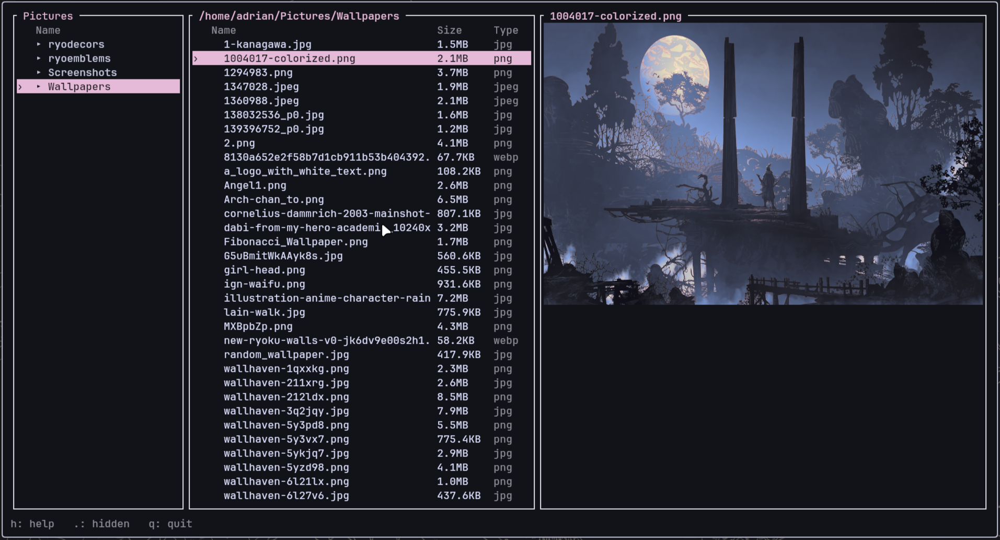

# filetui

A small, fast, minimalist three-panel file explorer for the terminal, written in
Rust with [Ratatui](https://ratatui.rs) and Crossterm.

It is deliberately simple — it does not try to compete with ranger, lf or yazi.
It is meant to be a pleasant, Unix-like place to move around a source tree.



## Features

- **Three panels**: parent directory on the left (with the current directory
  highlighted), current directory listing in the center, and details + preview
  on the right.
- **Columns**: name, size and type for every entry. Directories are shown
  first, sorted alphabetically.
- **Text preview**: the right panel shows metadata plus the start of text files.
  Binary files are detected by content sniffing and show metadata only.
- **Image preview**: images render inside the right panel using the
  [Kitty graphics protocol](https://sw.kovidgoyal.net/kitty/graphics-protocol/)
  on kitty/wezterm terminals (detected via `TERM`, `TERM_PROGRAM` or
  `KITTY_WINDOW_ID`). Other terminals show metadata plus a hint.
  Real PNGs stream as-is when they fit; JPEG/GIF/BMP/WebP/TIFF/ICO are
  decoded, downscaled to the area's on-screen resolution and re-encoded to
  PNG (`f=100`), the only portable kitty format — so every extension renders
  identically and sharp without ever shipping a giant payload.
- **Fullscreen viewer**: `Enter` or `→` on a file opens it fullscreen. Text
  scrolls, images zoom (`→`) and pan (`j/k/h/l` or the wheel), binary files
  show metadata. Close with `Esc`, `q` or `Backspace`.
- **Hidden files** toggled with `.`.
- **Fullscreen help** with `h`.

> **Without kitty (e.g. a plain fish over ssh):** images open as metadata plus
> a hint instead of a graphic — the kitty protocol cannot run there, so the
> viewer never falls back to a half-working render.

## Keys

| Key             | Action                                   |
| --------------- | ---------------------------------------- |
| `↑` / `↓`, `j`/`k` | Move the selection                  |
| `Enter` / `→`   | Enter a directory, or open a file fullscreen |
| `Backspace` / `←`| Go to the parent directory             |
| `g` / `G`       | Jump to first / last entry              |
| `Home` / `End`  | Jump to first / last entry              |
| `h`             | Toggle help                             |
| `.`             | Toggle hidden files                     |
| `q`             | Quit                                    |

### Fullscreen viewer

| Key            | Action                                         |
| -------------- | ---------------------------------------------- |
| `→`            | Zoom in an image (1 → 2 → 4 → 8)               |
| `←`            | Zoom out an image; closes again at 1:1         |
| `j`/`k`, `↑`/`↓` | Scroll (text) or pan up/down (zoomed image)   |
| `h`/`l`        | Pan left/right (zoomed image)                  |
| `PgUp`/`PgDn`  | Scroll by one page (text)                      |
| `g` / `G`      | Jump to top / bottom (text)                    |
| mouse wheel    | Scroll (text) or zoom (image)                  |
| `Esc` / `q` / `Backspace` | Close the viewer                     |

Text documents are read once when opened, capped at 1 MiB / 50 000 lines (a
`… (truncated)` marker is shown). Closing the viewer never quits the app.

### Operations

| Key   | Action                                            |
| ----- | ------------------------------------------------- |
| `n`   | Create directory (type the name, press Enter)     |
| `N`   | Create file                                       |
| `r`   | Rename the selected entry                         |
| `d`   | Delete the selected entry (asks confirmation `y`/`n`) |
| `c`   | Copy the selected entry to the clipboard          |
| `m`   | Move the selected entry (cut to the clipboard)    |
| `p`   | Paste the clipboard into the current directory    |

Copies are never overwritten: if the name exists a `.copy1`, `.copy2`, … suffix
is appended. In dialogs, `Enter` confirms, `Esc` cancels, and `Backspace` /
`Delete` edit the text.

## Build and run

```sh
cargo build --release
target/release/filetui            # starts in the current directory
target/release/filetui /some/path # or start somewhere specific
```

## Safety

Destructive operations (`d`) always require confirmation. Errors such as
insufficient permissions, missing files, or failing cross-device moves are
reported in the status bar or a dialog and never crash the app. Symlinks are
shown and entered transparently. The terminal is always restored on exit, even
after an error.

## Architecture

The code is split into clearly separated modules; render code never touches the
filesystem.

| Module      | Responsibility                                          |
| ----------- | ------------------------------------------------------- |
| `fsops`     | Every filesystem operation (list, create, rename, delete, copy, move) |
| `state`     | Application state: cwd, parent, entries, selection, dialogs, clipboard, navigation, fullscreen viewer |
| `input`     | Key/mouse events → state transitions (including the viewer) |
| `dialogs`   | Dialog business logic (submitting mutations, confirms)  |
| `preview`   | Text/binary preview content and fullscreen documents    |
| `img`       | Kitty graphics protocol: preview/fullscreen placement, zoom/pan crop, fitting, base64 chunking, delete |
| `ui`        | All Ratatui rendering (panels, help, dialogs, status, viewer) |

Run the tests with `cargo test`.
